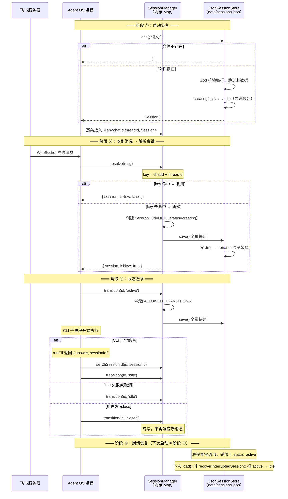

# 飞书会话持久化

## 概述

Agent OS 把飞书的一个话题（thread）映射为一个内存会话（Session），状态变动实时写盘到 `data/sessions.json`。重启后自动恢复，中断的任务自动回退到空闲。

## 数据结构

```typescript
interface Session {
  id: string            // Agent OS 自己生成的 UUID
  threadId: string      // 飞书话题 ID，同一个话题里的消息共享
  chatId: string        // 飞书群聊或单聊 ID
  cliId: 'claude'       // 执行引擎类型
  cliSessionId?: string // CLI 返回的会话 ID，供 --resume 续写
  status: 'creating' | 'active' | 'idle' | 'closed'
  createdAt: string     // ISO 时间戳
  updatedAt: string     // ISO 时间戳
}
```

磁盘文件 `data/sessions.json` 是一个 JSON 数组，每条记录一个 Session。

## 状态机

```
creating  ──→ active  ──→ idle ──┐
   │           │           │      │
   └───────────┴───────────┴──→ closed（终态，不可逆）
```

| 状态 | 含义 |
|------|------|
| `creating` | 新话题刚收到消息，还没开始执行 |
| `active` | CLI 子进程正在运行 |
| `idle` | 任务执行完毕，等待下次追问 |
| `closed` | 用户发了 `/close`，会话已终止 |

合法转换：

| 当前状态 | 可转到 |
|----------|--------|
| creating | active、closed |
| active | idle、closed |
| idle | active、closed |
| closed | （无） |

## 全流程



## 原子写盘机制

`JsonSessionStore.save()` 通过三步保证写盘安全：

```
1. JSON.stringify(sessions, null, 2)    → 内存 Map 全量快照
2. writeFile(data/sessions.json.tmp)     → 先写临时文件
3. rename(.tmp → sessions.json)          → 操作系统级原子替换
```

如果进程在第 2 步崩溃，留下的 `.tmp` 文件不会影响下次启动（只读 `.json`）。如果第 3 步成功，新旧文件替换是 OS 保证的原子操作，不会出现半个 JSON。

**并发控制**：`writeQueue` Promise 链把对同一文件的所有写入串行化，杜绝两个快照交叉落盘。

```
save() {
  this.writeQueue = this.writeQueue.then(write, write)
}
```

## 内存与磁盘的一致性

每个写盘操作都遵循 **先改内存 → 再写盘 → 失败回滚** 的模式：

```
resolve() / transition() / setCliSessionId():
  1. 更新内存 Map
  2. persist() → save() 写盘
  3. 如果写盘失败 → 内存回滚到旧值
```

这保证：要么内存和磁盘都更新成功，要么都没变。

## 崩溃恢复

`recoverInterruptedSession()` 在 `load()` 时自动执行：

```typescript
function recoverInterruptedSession(session: Session): Session {
  if (session.status !== 'creating' && session.status !== 'active') {
    return session  // idle / closed → 不动
  }
  return { ...session, status: 'idle' }  // 中断的任务 → 回退空闲
}
```

| 场景 | 磁盘状态 | 恢复后 |
|------|----------|--------|
| 收到消息但还没启动 CLI 就崩了 | creating | idle |
| CLI 跑到一半崩了 | active | idle |
| 正常结束、idle 中重启 | idle | idle（不变） |
| 会话已关闭 | closed | closed（不变） |

恢复后，用户在同一话题再发消息就能正常复用这个会话继续工作。